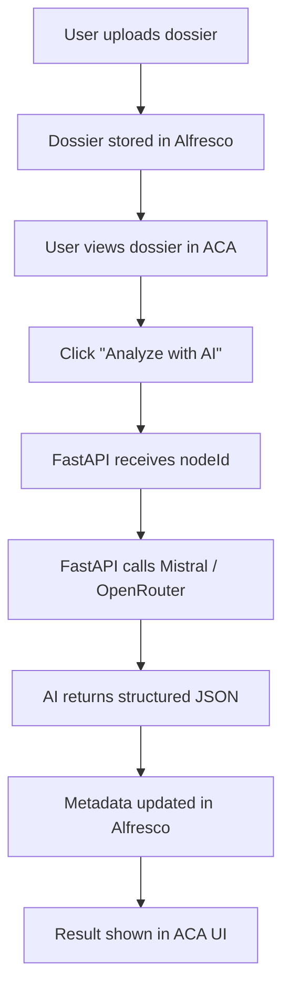

```mermaid
graph TD
    A[User uploads dossier] --> B[Dossier stored in Alfresco]
    B --> C[User views dossier in ACA]
    C --> D[Click &quot;Analyze with AI&quot;]
    D --> E[FastAPI receives nodeId]
    E --> F[FastAPI calls Mistral / OpenRouter]
    F --> G[AI returns structured JSON]
    G --> H[Metadata updated in Alfresco]
    H --> I[Result shown in ACA UI]

```